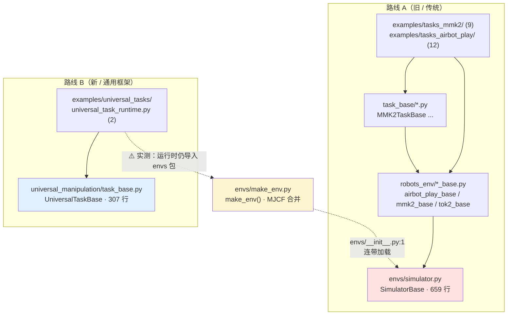
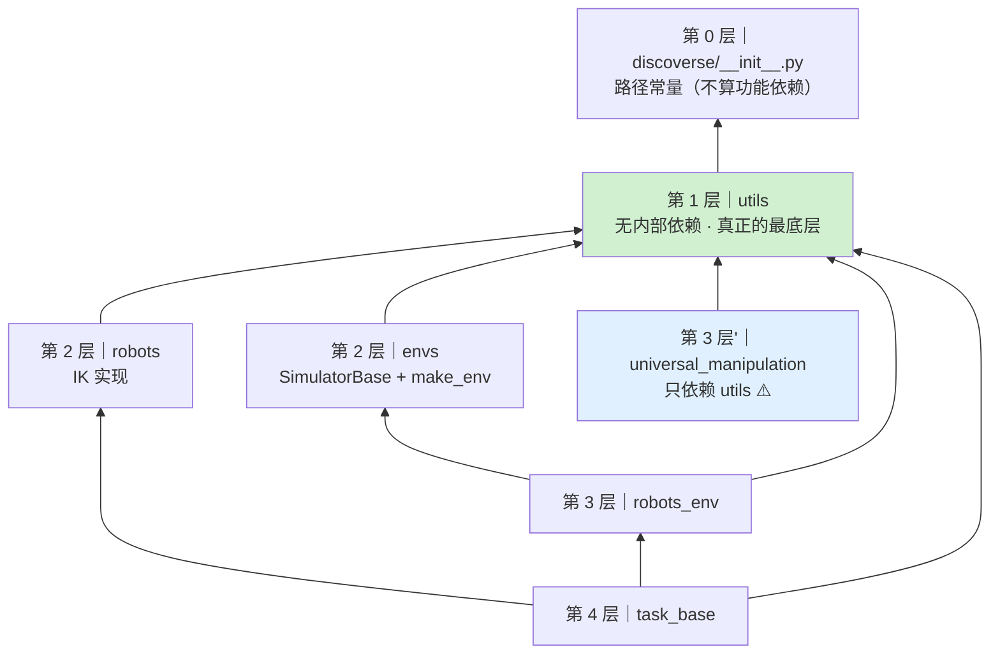
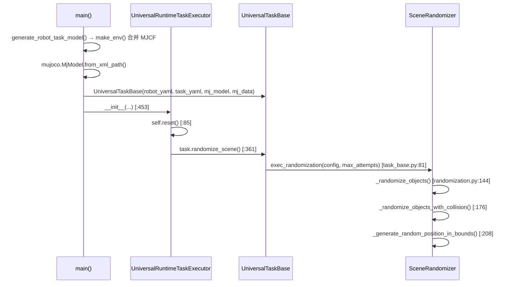
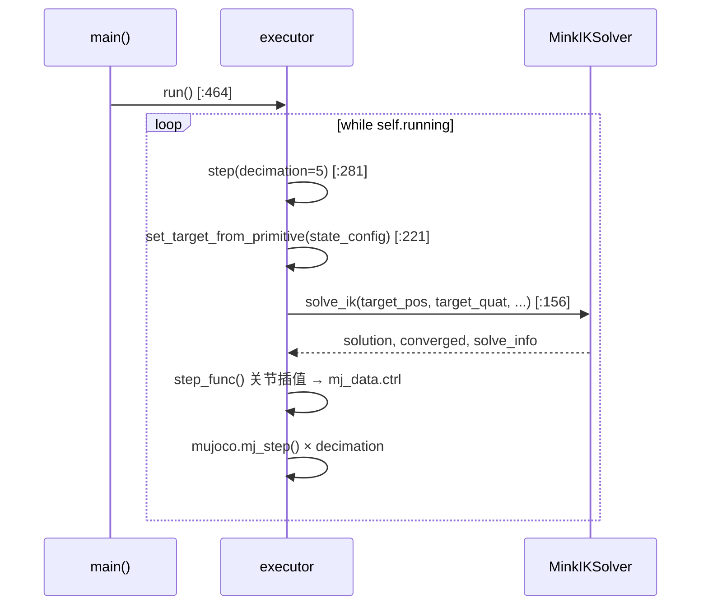
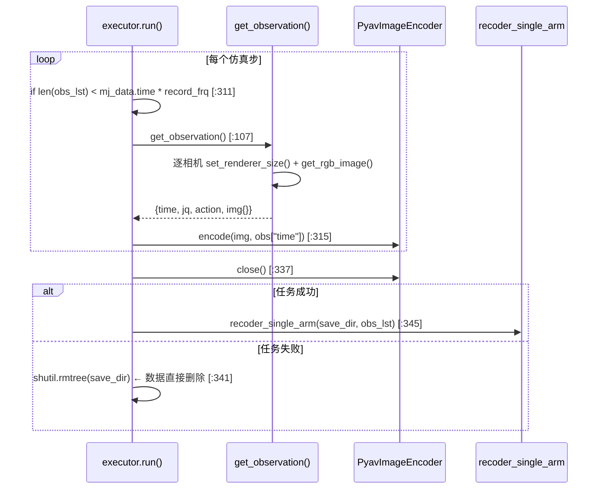
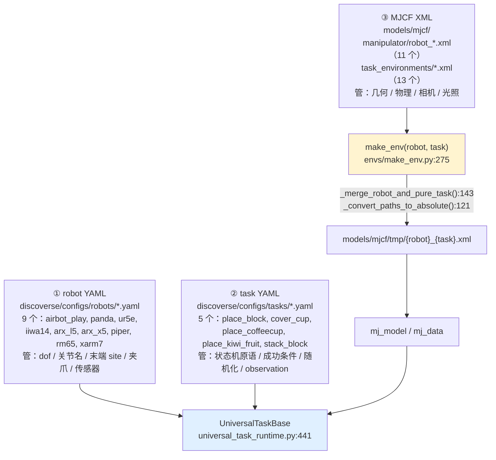

# DISCOVERSE 架构笔记

> **产出于**：Day 1 上午｜全局架构鸟瞰
> **方法**：入口点普查（静态） + 依赖测绘（静态） + monkey-patch 运行时追踪（动态）
> **追踪工具**：[scripts/dev/trace_chain.py](../scripts/dev/trace_chain.py)
> **实测环境**：`MUJOCO_GL=osmesa`，`~/miniconda3/envs/discoverse/bin/python`
> **实测组合**：`airbot_play × place_block`（10/10 状态完成，任务失败）、`airbot_play × cover_cup`（17/17 状态完成，任务成功）

本文所有结论都标注了**证据来源**（静态 grep / 运行时调用栈 / 读码）。凡是与教程 `docs/tutorial/day01-am-architecture.md` 「答案对照」不一致的地方，都保留原结论并附上实测修正。

---

## 一、入口点普查

`examples/` 下含 `if __name__ == "__main__"` 的目录分布（排除 `submodules/`、`policies/`）：

```
12 tasks_airbot_play    ← 最多，老框架主力
 9 tasks_mmk2
 9 robots
 9 hardware_sim
 7 ros1
 6 ros2
 4 active_slam
 3 mocap_ik
 2 universal_tasks      ← 只有 2 个，却号称「通用框架」
 ...（其余 6 个目录各 1-2 个）
```

**读出的情报**：新框架（`universal_tasks`）只有 2 个入口，老代码（`tasks_airbot_play` + `tasks_mmk2` = 21 个）是主体。**新框架覆盖面还很小** —— 这个判断不需要读任何代码。

三个入口目录导入的核心类**完全不同**：

| 入口目录 | 核心类 | 来自 |
|---|---|---|
| `examples/universal_tasks/` | `UniversalTaskBase` | `universal_manipulation/` |
| `examples/tasks_mmk2/` | `MMK2TaskBase` | `task_base/` |
| `examples/tasks_airbot_play/` | `AirbotPlayCfg` + `AirbotPlayIK` | `robots_env/` + `robots/` |

---

## 二、双路线架构



### 结论 1（教程原结论，实测确认成立）

`universal_manipulation/` 包内**没有任何一处** import `SimulatorBase`：

```bash
grep -rn "SimulatorBase\|from discoverse.envs" discoverse/universal_manipulation/
# 输出为空
```

两条路线**各自实现了一套**仿真主循环、数据记录器、状态机。这是典型的「重构进行到一半」形态：新框架想统一所有机器人，但 MMK2 这类双臂移动机器人尚未迁移。

### ⚠️ 实测修正：这个独立性只在「包源码层面」成立

Route B 的**运行时入口**并没有摆脱 Route A。证据链：

1. `examples/universal_tasks/universal_task_runtime.py:13` → `from discoverse.envs import make_env`
2. `discoverse/envs/__init__.py:1` → `from .simulator import SimulatorBase`
3. 实测：仅 `import universal_task_runtime`，不跑任何任务，`'discoverse.envs.simulator' in sys.modules` 就已经是 `True`

而且这次导入会**吞掉一个异常**：

```
ModuleNotFoundError: No module named 'gaussian_renderer'
Warning: gaussian_splatting renderer not found. ...
```

`simulator.py:22` 的 3DGS 渲染器导入失败，被 try/except 降级成一行 Warning 打印。Route B 根本不用 3DGS，却要为 Route A 的可选依赖付出「每次启动都打一条警告」的代价。

**为什么这个修正重要**：
- 「源码不依赖」≠「运行时不加载」。要测 Route B 的启动隔离性，断言点必须是 `sys.modules`，不是 grep。
- Route B 想「摆脱 658 行历史包袱」的目标**没有真正达成**，只是把耦合点从继承关系挪到了一个 `import`。这是值得写进技术债报告的架构风险。

---

## 三、模块依赖分层

用**递归目录**形式重扫（教程原命令 `discoverse/$pkg/*.py` 只匹配一层，会静默漏掉 `robots/mmk2/` 等子目录）：

```bash
for pkg in envs universal_manipulation robots_env robots task_base utils; do
  n=$(grep -rhoE "from discoverse\.[a-z_]+" discoverse/$pkg/ 2>/dev/null \
      | sort -u | grep -v "discoverse\.$pkg" | tr '\n' ' ')
  printf "%-24s -> %s\n" "$pkg" "${n:-（无内部依赖）}"
done
```

实测输出：

```
envs                     -> from discoverse.utils
universal_manipulation   -> from discoverse.utils          ← 刻意绕开 envs
robots_env               -> from discoverse.envs from discoverse.utils
robots                   -> from discoverse.utils
task_base                -> from discoverse.robots from discoverse.robots_env from discoverse.utils
utils                    -> （无内部依赖）
```



**无循环依赖** —— 箭头单向，这点对测试是好消息（任一层都能独立起测）。

**测试意义**：`utils` 无依赖 → 不需要 mock → **单元测试成本最低**，Day 1 下午第一批测试就从这里下手。`universal_manipulation` 同样只依赖 `utils`，是第二优先级。

---

## 四、真实调用链（运行时追踪）

以下三条链都是 monkey-patch 打桩后从**真实运行**里抓到的调用栈，不是读码推测。

### 4.1 初始化 + 随机化链



实测栈（节选，`SceneRandomizer.exec_randomization` 首次调用）：

```
universal_task_runtime.py:453  in main    → executor = UniversalRuntimeTaskExecutor(...)
universal_task_runtime.py:85   in __init__→ self.reset()
universal_task_runtime.py:361  in reset   → self.task.randomize_scene()
task_base.py:81  in randomize_scene       → self.randomizer.exec_randomization(...)
```

**关键**：随机化发生在 `__init__` 里（经 `reset()`），**不是** 在 `run()` 里。所以要在测试中控制随机化，必须在**构造执行器之前**下手 —— 这直接决定 Day 3-4 确定性 fixture 的插桩位置。

### 4.2 IK 求解链（主循环）



**四层结构**：主循环 `run()` → 单步 `step()` → 动作原语 `set_target_from_primitive()` → 求解器 `solve_ik()`。

- **循环在 `run()`**，`step()` 是单步高频调用 → 性能敏感，也是集成测试的切入点。
- **`solve_ik()` 是纯函数**：输入目标位姿、输出关节角 + 收敛标志 + 求解信息。**测 IK 精度不需要启动整个仿真** —— 只要一个 `mj_model` 就够。
- `step(decimation=5)` 里一次调用推进 5 个 `mj_step`，而关节插值步长乘了 `decimation * opt.timestep` → **控制频率 = 仿真频率 / 5**。这个关系是 Day 3-4 区分「物理引擎不确定」和「控制时序不确定」的前提。

### 4.3 数据流链（仅部分任务走到）



**⚠️ 这条链在 `place_block` 下完全不执行** —— 见下文缺陷 B。

---

## 五、三层配置体系与汇合点



**两个汇合点，不是一个**：

1. **XML 层汇合于 `make_env()`**：`robot_{robot}.xml` + `task_environments/{task}.xml` → 合并成 `models/mjcf/tmp/{robot}_{task}.xml` 落盘，再 `from_xml_path` 加载。合并时的 site/body 命名冲突、相对路径解析是 45 组合失败的高发根因。
2. **YAML 层汇合于 `UniversalTaskBase.__init__`**（`universal_task_runtime.py:441`）：robot YAML 路径 + task YAML 路径 + 已加载的 `mj_model/mj_data` 一起传入。

### ⚠️ 「9×5=45」的分母来自 YAML，不是 XML

实测清点：

| 维度 | MJCF XML | YAML 配置 |
|---|---|---|
| 机器人 | 11 个（多出 `airbot_play_force`、`airbot_play_g2`） | **9 个** |
| 任务 | 13 个（多出 `open_drawer`、`peg_in_hole`、`push_mouse` 等 8 个） | **5 个** |

Route B 只能跑「两者都齐」的组合 → **9 × 5 = 45**。多出来的 2 个机器人变体和 8 个任务场景**有 XML 但没有 YAML**，Route B 跑不了（Route A 的老脚本才用它们）。

**测试意义**：参数化矩阵的边界应该由 YAML 清点决定；同时「有 XML 无 YAML」的 8 个任务本身是覆盖率缺口，值得在报告里点出来。

---

## 六、教程 Step 3 三个架构问题

### Q1：为什么 `universal_manipulation` 不依赖 `envs`？

Route B 是新框架，想摆脱 `SimulatorBase`（659 行，且耦合了 3DGS、ROS、多种传感器等大量可选能力）。它自己重写了一套轻量主循环、记录器、状态机，只保留对 `utils` 的依赖。

**但实测表明这个摆脱不彻底**（见第二节修正）：包源码干净，运行时入口仍 `from discoverse.envs import make_env`，连带加载 `simulator.py`。真正的原因是 **MJCF 合并逻辑（`make_env`）留在了 `envs` 包里**，Route B 没有自己的场景拼装能力，只能反向依赖。

### Q2：MMK2 测试能不能复用 universal_tasks 的 fixture？

**不能。** MMK2 走 Route A（`robots_env/mmk2_base.py` → `SimulatorBase`），universal_tasks 走 Route B（`UniversalTaskBase`）。两者的初始化方式、配置来源、主循环结构完全不同：

- Route B：`make_env` 合并 XML → `MjModel.from_xml_path` → `UniversalTaskBase(robot_yaml, task_yaml, model, data)`
- Route A：`AirbotPlayCfg`/`MMK2Cfg` 配置对象 → `SimulatorBase` 子类实例化，自带 `reset()/step()/view()`

**结论**：Day 15-17 的 MMK2 测试必须单独写一套 fixture。只有最底层的断言辅助（如位姿误差计算、关节限位校验）可以跨路线共享。

### Q3：9×5=45 组合中哪些会挂？根因在哪？

根因分三类，按可疑度排序：

1. **MJCF 合并冲突**（`_merge_robot_and_pure_task():143`）：机器人 XML 与任务 XML 若有同名 body/site/geom，合并后命名冲突或被静默覆盖。相对路径（mesh/texture）经 `_convert_paths_to_absolute():121` 转换，任务 XML 里的 `include` 路径尤其容易错。
2. **末端 site 与任务原语不匹配**：robot YAML 声明 `end_effector_site`，任务原语按该 site 算目标位姿。不同机器人的 site 定义位置（法兰 vs 指尖）不一致 → 抓取高度偏移全错。
3. **IK 不可达**：任务原语的目标位置是按 `airbot_play` 工作空间调的（`place_block.yaml` 里 `x_range:[0.2,0.4]`），换成臂长不同的机器人（如 `iiwa14` vs `piper`）可能超出可达范围 → `solve_ik` 不收敛。

**实测已知一例**：`airbot_play × place_block` 状态机跑满 10/10 但成功条件失败 —— `block_green` 与 `bowl_pink` 实际距离 0.2908 m，阈值 0.05 m。状态机「执行完了」但物体根本没被搬过去。**这类失败最危险：日志显示「完成状态 10/10」，看着像成功。**（对应计划里的缺陷 #4、#12 —— emoji 字符串匹配判定成败不可靠。）

---

## 七、五个测试视角问题（教程 4.2）

| 问题 | 答案（附证据） |
|---|---|
| **哪些模块无外部依赖，可直接单元测试？** | `discoverse/utils/`（实测无任何项目内 import）；其次 `universal_manipulation/` 的纯配置类：`robot_config.py`（`RobotConfigLoader` 只做 YAML 加载 + 校验）、`task_config.py`、`config_utils.py`。这三个是 Day 1 下午的第一批目标。 |
| **哪些函数是纯函数？** | `MinkIKSolver.solve_ik`（位姿 → 关节角 + 收敛标志，实测调用栈确认它在最内层）；`randomization.py:342 _generate_random_quaternion`、`:243 _check_collision_2d`（几何计算，无副作用）；`make_env.py:121 _convert_paths_to_absolute`、`:143 _merge_robot_and_pure_task`（XML 树变换，输入输出确定）。**测这些不需要启动仿真。** |
| **哪里有全局状态 / 单例 / 类属性？** | ① **无种子的全局 `np.random`**（15+ 处，见缺陷 D）—— 最大的测试间污染源；② `mj_model` 被随机化直接改写（`light_ambient`、`light_diffuse`、桌面高度、材质），**同一个 model 对象跑两次任务，第二次的初始条件已被第一次污染** → fixture 里 `mj_model` 若用 `session` 作用域会串味；③ `make_env` 落盘到固定路径 `models/mjcf/tmp/{robot}_{task}.xml`，并行测试（pytest-xdist）会互相覆盖；④ `save_dir` 也是固定路径 `data/{robot}_{task}`，同样不带 episode 索引。 |
| **随机性从哪进入系统？** | 唯一入口是 `randomization.py` 里的全局 `np.random.*`，经 `exec_randomization` 在 `executor.__init__ → reset()` 阶段作用于 `mj_model`/`mj_data`。**没有任何 seed 设置代码**（见缺陷 D）。Day 3-4 的做法：在构造 executor 之前 `np.random.seed(n)`，或给 `SceneRandomizer` 注入 `np.random.Generator`。 |
| **测「IK 求解精度」要启动整个仿真吗？** | **不用。** `solve_ik` 只需要 `mj_model`（+ 一份 `mj_data` 做 FK 校验）。可以直接 `make_env` 生成 model 后单独构造 `MinkIKSolver`，不碰 `UniversalRuntimeTaskExecutor`、不跑 `run()`、不开渲染器。这是「单元级」而非「集成级」测试 —— 也是 Day 15-17 做 FK→IK→FK 往返一致性验证的技术前提。 |

---

## 八、本次实测新发现的缺陷（供后续测试日引用）

### 缺陷 A｜Route B 运行时仍加载 `simulator.py`，并吞掉 3DGS 导入异常

- **现象**：仅 `import universal_task_runtime`，`'discoverse.envs.simulator' in sys.modules == True`，且打印 `ModuleNotFoundError: No module named 'gaussian_renderer'` 后降级为 Warning 继续。
- **根因**：`universal_task_runtime.py:13` → `discoverse/envs/__init__.py:1` → `simulator.py:22`。`envs/__init__.py` 无条件导出 `SimulatorBase`，导入 `make_env` 就连带全部加载。
- **影响**：Day 10-11 CI 启动时间、Day 13-14 结构化结果契约（这条 Warning 会混进 stdout 干扰字符串匹配判定）。
- **修复方向**（不在本日范围）：把 `make_env` 的 MJCF 合并逻辑下沉到不依赖 `simulator` 的模块，或 `envs/__init__.py` 改惰性导入。

### 缺陷 B｜5 个任务 YAML 中 4 个缺 `observation:` 段 → 全程不录视频

- **现象**：`PyavImageEncoder.encode` 探针在 `airbot_play × place_block` 下**一次都没触发**；换成 `cover_cup` 立即触发。
  ```
  place_block: 3/4 探针触发，⬜ PyavImageEncoder.encode
  cover_cup:   4/4 探针触发
  ```
- **根因**：`camera_encoders` 由 `task_config.camera_configs` 驱动（`universal_task_runtime.py:80,389`），该 property 读 YAML 的 `observation.cameras`（`task_config.py:172`）。实测清点：
  ```bash
  for f in discoverse/configs/tasks/*.yaml; do printf "%-50s %s\n" "$f" "$(grep -c '^observation:' $f)"; done
  # cover_cup.yaml         1
  # place_block.yaml       0   ← 无
  # place_coffeecup.yaml   0   ← 无
  # place_kiwi_fruit.yaml  0   ← 无
  # stack_block.yaml       0   ← 无
  ```
  模板 `templates/place_object.yaml` 里也没有 `observation:` 段，所以 `extends` 继承不到。
- **影响**：**这是数据采集功能的静默失效** —— 4/5 的任务跑完只产出 `obs_action.json`，没有任何视频。而 `camera_cfgs` 为空时 `get_observation()` 的相机循环也不执行，连图像都不采。任务「成功」了，数据集是残缺的。归 Day 18-19 数据质量验证器；`place_block` 是最常用的 demo 任务，这个缺口影响面很大。
- **回归锚点**：`scripts/dev/trace_chain.py -t place_block` 的「3/4 触发」是这个缺陷的可复现证据，修好后应变成 4/4。

### 缺陷 C｜`record_fps` 的默认值写法失效

- **现象/根因**：`discoverse/universal_manipulation/task_config.py:165-167`
  ```python
  return self.config.get('observation', {'fps': 30}).get('fps', 30)
  ```
  默认字典 `{'fps': 30}` 只在 `observation` **整段缺失**时才生效；而当 `observation` 存在但没写 `fps` 时，走的是内层 `.get('fps', 30)`。两条路的结果恰好都是 30，所以**当前不表现为 bug** —— 但这是个「靠巧合正确」的写法：一旦两处默认值改成不同的数，行为就随配置形态漂移。
- **影响**：Day 1-2 配置层单测应覆盖三种输入（无 `observation` / 有但无 `fps` / 有 `fps`），把这个隐含契约钉死。

### 缺陷 D｜随机性完全无种子控制（印证计划缺陷 #2）

- **现象**：
  ```bash
  grep -rn "seed" discoverse/universal_manipulation/ examples/universal_tasks/universal_task_runtime.py
  # 输出为空
  ```
  而 `randomization.py` 有 15+ 处全局 `np.random.uniform/random`（`:230-231` 物体位置、`:299-304` 相机偏移、`:322-327` 姿态、`:350` 随机四元数、`:378-383` 光照）。
- **影响**：**仿真不可复现** —— 违反项目自己声明的「确定性仿真（相同种子→相同结果）」设计原则（CLAUDE.md）。测试无法稳定断言，失败无法复现。这是 Day 3-4 确定性攻坚的核心靶子。
- **修复方向**：`SceneRandomizer.__init__` 接收 `rng: np.random.Generator`，全部 `np.random.X` 换成 `self.rng.X`；同时让 task YAML 的 seed 配置真正生效。

### 补充观察｜失败即删数据

`universal_task_runtime.py:341` 在任务失败时 `shutil.rmtree(self.save_dir)`。调试时**失败样本的数据全部丢失**，无法事后分析「为什么 block 没被搬过去」。Day 13-14 重构结果契约时应加开关保留失败样本。

---

## 九、方法论沉淀

```
1. 划边界    —— 先排除 submodules / policies，别贪心
2. 普查入口  —— grep "__main__"，数量分布本身就是情报
3. 依赖测绘  —— 扫 import 方向推出分层，最底层 = 最好测的地方
4. 动态追踪  —— monkey patch + traceback，静态阅读会骗人
5. 画图      —— 卡住的地方就是没懂的地方
6. 提测试问题 —— 纯函数在哪？全局状态在哪？随机性从哪进来？
```

**本次三个最有价值的收获**：

1. **动静必须结合**。静态 grep 说 Route B「完全绕开 envs」，运行时 `sys.modules` 说「还是加载了」。**两个结论都对，但只有合起来才是完整事实**（缺陷 A）。
2. **「关注缺失」从理论变成了实战**。四个探针里**没触发的那一个**信息量最大 —— 它暴露了 4/5 任务不录视频的静默失效（缺陷 B）。如果只看触发的三个，这个缺陷完全看不见。
3. **「完成状态 10/10」不等于成功**。状态机跑满全程、日志一片正常，物体距离目标 0.29 m。任何基于「跑完没报错」的判定都是不可靠的 —— 这直接说明了为什么 Day 13-14 要把 emoji 字符串匹配换成结构化结果契约。

---

## 十、验收清单对照

- [x] Step 1 入口普查，自己得出「三个入口走不同路线」的结论
- [x] Step 2 依赖测绘，找出 `utils` 是最底层（并修正了教程原命令的漏扫 bug）
- [x] monkey-patch 打印出 `solve_ik` 的调用栈
- [x] 额外追踪了 3 个函数（`exec_randomization`、`_generate_random_position_in_bounds`、`PyavImageEncoder.encode`），且入库为可复用工具 [scripts/dev/trace_chain.py](../scripts/dev/trace_chain.py)
- [x] 本文含 Mermaid 分层图 ×1、双路线图 ×1、配置汇合图 ×1、调用链时序图 ×3
- [x] 回答了 4.2 的五个测试问题 + Step 3 的三个架构问题
- [x] devil-note 记录了卡点与解决过程 → [devil-note-day01.md](devil-note-day01.md)

**额外产出**：4 个此前未记录的缺陷（A/B/C/D）+ 1 个补充观察，均带可复现证据。
