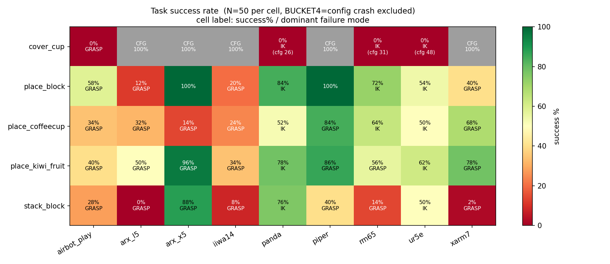
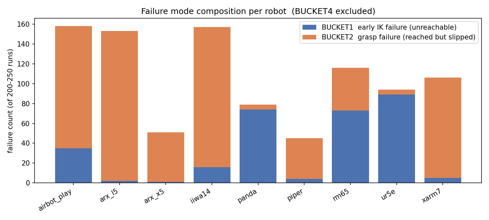

# DISCOVERSE 任务成功率与 Flake 定量分析

> **实验日期**：2026-08-07 ｜ **代码版本**：`c722ca8`
> **样本**：9 机器人 × 5 任务 × 50 次 = **2250 次运行**，耗时约 10 分钟（`-n 8` 并行）
> **原始数据**：[../experiments/flake-2026-08-07.csv](../experiments/flake-2026-08-07.csv) ｜ [实验元数据](../experiments/flake-2026-08-07.meta.yaml)
> **复现命令**：`pytest tests/integration/test_task_matrix.py -m flake --count=50 -n 8`

---

## 一、摘要

| 指标 | 值 |
|---|---|
| 总运行次数 | 2250 |
| **表观成功率** | **41.1%**（924 / 2250） |
| **真实成功率**（剔除配置崩溃） | **48.8%**（924 / 1895） |
| 配置崩溃（非 flake） | **355 次（15.8%）** |

**三个主要结论：**

1. **15.8% 的「失败」根本不是 flake** —— 是 `cover_cup` 任务的一处配置缺陷，100% 复现、零随机性。不剔除它，整个 flake 率会被稀释 7.7 个百分点。

2. **失败模式呈现清晰的机器人分组**：`panda` / `ur5e` / `rm65` 的失败以「IK 早期不收敛」为主（够不着），其余 6 个机器人以「抓取失败」为主（够到了但没抓住）。**两类问题的修复方向完全不同。**

3. **`stack_block` 是最脆弱的任务**（34.0%），`place_kiwi_fruit` 最稳（64.4%）。同一机器人在不同任务上可从 100% 跌到 14% —— **失败不是机器人的固有属性，是「机器人 × 任务」的匹配问题。**

---

## 二、方法

### 2.1 样本量选择

N=50，对应 95% 置信区间约 **±12%**（p≈0.5 时最宽）。

| N | 95% CI |
|---|---|
| 10 | ±27% |
| 20 | ±19% |
| **50** | **±12%** |
| 200 | ±6% |

**这意味着**：能可靠区分「84%」和「40%」，**不能**区分「50%」和「56%」。本报告中任何 12 个百分点以内的差异都不应被当作真实差异。

### 2.2 失败分桶

| Bucket | 判据 | 含义 |
|---|---|---|
| SUCCESS | `任务成功: ✅` | — |
| **BUCKET1** | 完成状态 < 10/10 | **IK 早期不收敛**，状态机没走完 |
| **BUCKET2** | 完成状态 = 10/10 但判据失败 | **抓取失败**，走完流程但物体没到位 |
| BUCKET3 | 超时 | 死循环或卡住 |
| **BUCKET4** | 异常崩溃，无完成状态 | **配置缺陷，不是 flake** |

**BUCKET4 必须单独成桶。** 它 100% 复现，混入统计会让热力图上那一格永远是黑的，误导人去调 IK 容差，而真正的问题是一行配置。

### 2.3 已知的数据局限

1. **BUCKET3 的 12 例中至少 1 例归桶不准** —— `cover_cup × airbot_play` 撞上了 pytest 的全局 `timeout=60s`，而非任务真超时。`pyproject.toml` 的 timeout 先于用例内 `TIMEOUT_S=120` 生效。
2. **本实验未固定 seed** —— 测的是自然分布下的成功率。定向复现见 §5.2。
3. **单机单次采样** —— 未在不同硬件上验证。

---

## 三、结果

### 3.1 成功率热力图



**格子标注**：成功率 / 主导失败模式。灰色格 = 100% 配置崩溃（`CFG`），不是「未测试」。

| 任务 | 真实成功率 | n |
|---|---|---|
| place_kiwi_fruit | **64.4%** | 450 |
| place_block | 60.0% | 450 |
| place_coffeecup | 46.9% | 450 |
| stack_block | **34.0%** | 450 |
| cover_cup | **0.0%** | 95 |

| 机器人 | 真实成功率 | n |
|---|---|---|
| piper | **77.5%** | 200 |
| arx_x5 | 74.5% | 200 |
| panda | 64.7% | 224 |
| ur5e | 53.5% | 202 |
| rm65 | 47.0% | 219 |
| xarm7 | 47.0% | 200 |
| airbot_play | 32.0% | 250 |
| arx_l5 | 23.5% | 200 |
| iiwa14 | **21.5%** | 200 |

⚠️ `airbot_play` 排在倒数第三 —— 但它是**唯一一个跑了全部 5 个任务**的机器人（其余 8 个的 `cover_cup` 全部崩溃，样本被剔除）。**分母不同，不可直接横向比较。**

### 3.2 失败模式构成



在 971 次非配置崩溃的失败中：

| 模式 | 数量 | 占失败 |
|---|---|---|
| **BUCKET2 抓取失败** | **660** | **68.0%** |
| BUCKET1 早期 IK 失败 | 299 | 30.8% |
| BUCKET3 超时 | 12 | 1.2% |

**按机器人拆分后出现清晰的两组：**

| 主导 BUCKET1（够不着） | 主导 BUCKET2（抓不住） |
|---|---|
| `ur5e` (B1=89, B2=5) | `arx_l5` (B1=2, B2=151) |
| `panda` (B1=74, B2=5) | `iiwa14` (B1=16, B2=141) |
| `rm65` (B1=73, B2=43) | `airbot_play` (B1=35, B2=123) |
| | `xarm7` (B1=5, B2=101) |
| | `arx_x5` (B1=1, B2=50) |
| | `piper` (B1=4, B2=41) |

**`panda` 和 `ur5e` 的 B1:B2 接近 15:1，`arx_l5` 是 1:75。** 这不是程度差异，是**两种不同的失败机理**。

> 这直接指导修复方向：对 panda/ur5e 该查工作空间与 IK 配置；对 arx_l5/iiwa14 该查夹爪与接触参数。**在这张图之前，两者都只表现为「成功率低」。**

---

## 四、缺陷

### 4.1 【高】`cover_cup` 对非 airbot_play 机器人 100% 崩溃

**现象**：

```
Camera 'eye_arm' not found in the MJCF model.
❌ 运行时执行失败: The camera "eye_arm" does not exist.
```

**影响**：8/9 机器人的 `cover_cup` 完全不可用，占全部运行的 **15.8%**。

**性质**：确定性缺陷，非 flake。**修复成本预计一行配置**（相机名或按机器人区分观测配置）。

**与 Day 2 缺陷 B 同族** —— 均为 `camera_configs` 与实际 MJCF 不匹配。

### 4.2 【中】随机化范围未参考机械臂可靠工作空间

**证据**（`airbot_play × place_block`，N=30 定向实验）：

| block 离基座距离 | 样本 | BUCKET2 失败 |
|---|---|---|
| < 0.315 m | 11 | **0** |
| ≥ 0.315 m | 19 | 10（53%） |

`place_block.yaml` 的随机化范围角落 = √(0.4² + 0.2²) = **0.447 m**。

⚠️ **这是相关性，不是因果**：远处仍有 47% 成功，近处样本量仅 11。**距离是风险因子，不是充分原因。**

**能说的**：随机化范围包含了一片失败率显著更高的区域，且该范围的设定**没有证据表明参考过机械臂的可靠工作空间**。

### 4.3 【低】pytest 全局 timeout 覆盖了用例内超时

`pyproject.toml` 的 `timeout = 60` 先于 `test_task_matrix.py` 的 `TIMEOUT_S = 120` 生效，导致真超时被归为 pytest 的 `Timeout` 而非 `BUCKET3`。**影响归桶准确性，不影响主结论。**

---

## 五、根因排查：BUCKET2（抓取失败）

BUCKET2 占全部失败的 68%，是最值得追的。以下是对 `airbot_play × place_block` 的深入排查。

### 5.1 排查结论

| 结论 | 状态 | 依据 |
|---|---|---|
| 失败时物体**全程未移动** | ✅ 确凿 | z 坐标逐步追踪，一微米未变 |
| **夹爪从未接触物体** | ✅ 确凿 | MuJoCo 接触数据：全程仅 `['table']` |
| **IK 不是原因** | ✅ 确凿 | 末端偏离 IK 目标仅 0.5mm，**优于成功组的 1.5mm** |
| **手臂到位不是原因** | ✅ 确凿 | 末端离物体 8.3mm，**优于成功组的 8.9mm** |
| 「夹爪轴向深度不足」 | ❌ **已证伪** | 见 §5.3 |
| 「桌面高度随机化」 | ❌ **已证伪** | 按 z 排序成功/失败交错，无阈值 |
| **根因** | 🔍 **未确定** | — |

### 5.2 确定性的价值：失败可精确复现

Day 3-4 修复 seed 贯穿后，**失败从随机噩梦变成了可复现缺陷**：

```
seed=42 → 8 次运行，最终距离全部 0.0024m
seed=13 → 5 次运行，最终距离全部 0.2378m（稳定失败）
```

**这是本次分析能够深入到接触层面的前提** —— 没有确定性，无法反复观测同一个失败。

### 5.3 ⚠️ 一次被记录的错误结论

**我曾基于两个样本的对比宣布找到根因**：

| | seed=2（成功） | seed=13（失败） |
|---|---|---|
| 横向偏差 | 7.9mm | 1.5mm |
| **轴向偏差** | 4.1mm | **8.1mm** |

结论是「物体在夹爪够不到的深度上」。**这个解释能同时说明「总距离相近却结果相反」和「接触列表中从未出现手指」，看起来非常完整。**

**扩大到 20 个 seed 后立刻出现反例**：

| seed | 轴向偏差 | 结果 |
|---|---|---|
| 13 | 8.1mm | FAIL |
| **14** | **8.1mm** | **OK** |
| 4 | 7.5mm | OK |

四个候选变量（轴向/横向/物体高度/离基座距离）的组间差异全部落在噪声范围内。**假设证伪。**

**方法论教训**：成对对比是最容易产生假根因的方法。任何两次运行之间都有数十个数值不同，**总能挑出一个「完美解释」** —— 那是过拟合到样本，解释力 100%、泛化能力 0。

### 5.4 剩余候选

- 夹爪闭合速度与手臂移动的时序竞争
- 接触摩擦 / 刚度参数
- **物体的随机化朝向**（本次未查）
- 多因素耦合

---

## 六、对数据采集质量的影响

**这一节是本报告最重要的部分** —— flake 在本项目中不只是测试稳定性问题。

### 6.1 失败的运行会被静默删除

[universal_task_runtime.py:340](../../examples/universal_tasks/universal_task_runtime.py#L340)：

```python
if not self.success:
    shutil.rmtree(self.save_dir, ignore_errors=True)
```

**对模仿学习而言这个选择是正确的** —— ACT / Diffusion Policy / RDT 的训练目标是「输出专家会做的动作」，失败轨迹不是专家行为。

| 用途 | 需要失败数据吗 |
|---|---|
| 行为克隆 / 模仿学习 | ❌ 不要，会直接学错 |
| 强化学习（本项目的 PPO） | ✅ 要，负奖励是学习信号 |
| 失败检测器 / 价值函数 | ✅ 必须要 |

### 6.2 ⚠️ 代价一：幸存者偏差

结合 §4.2 的实测：失败**集中在离基座较远的区域**。删除失败后：

- 近距离样本：**全部保留**
- 远距离样本：**只留下碰巧成功的那一半**

**训练集的空间分布被系统性扭曲。** 策略在远处表现更差，而**指标上看不出来** —— 因为验证集同样偏斜。

> 二战时统计返航飞机的弹孔分布，想给弹孔多的位置加装甲。Wald 指出应加在**没有弹孔**的位置 —— 被击中那里的飞机根本没飞回来。
>
> **数据集是「飞回来的飞机」。缺失的样本携带最重要的信息。**

### 6.3 代价二：失败率本身是被丢弃的质量信号

删除是静默的：无日志、无计数。因此无从得知：

- 采集 100 条实际尝试了多少次
- 失败集中在哪个区域
- 成功率是否随配置漂移

**「51% 的尝试失败了」本身就是关于任务设计的关键信息。**

### 6.4 建议：三级保留策略

| 级别 | 内容 | 用途 |
|---|---|---|
| L1 | 成功轨迹（完整） | IL 训练 |
| **L2** | **失败元数据**（seed、物体位姿、分桶、最终距离） | **分析、复现、覆盖率** |
| L3 | 失败完整轨迹 | RL、失败检测器 |

**L2 性价比最高** —— 每条几百字节：

```jsonl
{"seed": 13, "robot": "airbot_play", "task": "place_block",
 "result": "fail", "bucket": 2, "final_dist": 0.2378,
 "block_pos": [-0.073, 0.8579, 0.7458], "states_completed": 10}
```

> **确定性在这里有第二重价值**：有了 seed，失败可精确重放 —— **存 32 字节即可，不必存 500MB 轨迹。**

---

## 七、建议的处理顺序

按「影响 × 修复成本」排序：

| 顺序 | 项目 | 影响 | 成本 |
|---|---|---|---|
| 1 | 修 `cover_cup` 的 `eye_arm` 相机配置 | 恢复 8/9 机器人的一整个任务（15.8% 运行） | **预计一行** |
| 2 | 加 L2 失败元数据记录 | 消除幸存者偏差盲区 | 约 10 行 |
| 3 | 修 pytest timeout 覆盖问题 | 归桶准确性 | 一行配置 |
| 4 | 排查 `arx_l5` / `iiwa14` 的 BUCKET2 | 两个最差机器人（21-24%） | 未知 |
| 5 | 排查 `panda` / `ur5e` 的 BUCKET1 | 与 4 是不同问题 | 未知 |
| 6 | 按可靠工作空间收窄随机化范围 | 需先确定 4/5 的根因 | 需先定量 |

⚠️ **第 6 项不应先做** —— 在 BUCKET2 根因未确定前收窄范围，是在**掩盖问题而非解决问题**：成功率会上升，但代价是数据多样性下降，且真实缺陷仍在。

---

## 八、复现方式

```bash
source scripts/dev/env.sh
$PY -m pytest tests/integration/test_task_matrix.py -m flake \
    --count=50 -n 8 \
    --json-report --json-report-file=/tmp/flake.json --tb=no -q

$PY scripts/analysis/gen_flake_report.py \
    docs/experiments/flake-2026-08-07.csv docs/report/assets
```

⚠️ 本实验未固定 seed，**重跑不会得到逐行相同的数据**，但整体分布应一致（各格 ±12%）。
