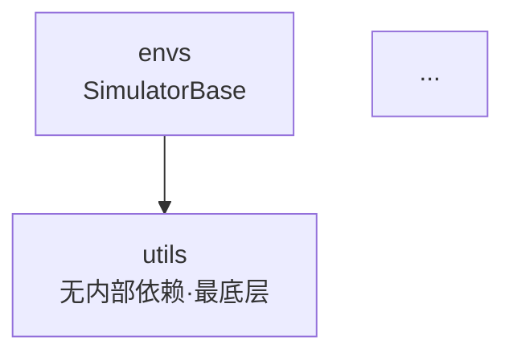

# Day 1 上午 — 全局架构鸟瞰

> **本课的真正目的**：不是让你记住 DISCOVERSE 的架构（那是结论，我直接告诉你也没用），
> 而是让你掌握**拿到任何陌生项目时的入手方法论**。
>
> 三周后你去新公司，第一周一定是接手一个你完全不懂的代码库。今天练的就是那个场景。

---

## 先破除一个错误认知

新手拿到陌生项目，最常见的三种错误做法：

| 错误做法 | 为什么错 |
|---|---|
| **从 README 开始读** | README 写的是「作者希望你怎么用」，不是「代码实际怎么跑」。而且经常过期 |
| **从第一个文件挨个读到最后** | 382 个 Python 文件，读完要两周，读完也串不起来 |
| **打开 IDE 全局搜索关键词** | 搜到一堆结果，不知道哪个是主干哪个是死代码 |

**成熟的做法只有一条主线：从「能跑起来的入口」反向追**。

理由很简单：**能跑通的代码路径 = 活代码**。项目里大量代码是废弃的、实验性的、给别的场景用的。你先追活的那条，架构骨架自然浮现。

> 💡 这也是测试开发的天然优势 —— 测试人本来就习惯从「用户怎么用」往下追，而不是从「代码怎么写」往上看。

---

## 本课四步法

```
Step 1  普查入口     —— 这个项目有几个「能跑的东西」？
Step 2  依赖测绘     —— 模块之间谁依赖谁？（找分层）
Step 3  调用链追踪   —— 挑一条主线，打印真实调用栈
Step 4  画图 + 提问  —— 画出来，然后问「测试该切在哪」
```

每步都有可复用的命令。**这套流程你要背下来，换个项目照用。**

---

## Step 1｜普查入口：这个项目有几个「能跑的东西」

### 1.1 找所有可执行入口

```bash
cd /home/ubuntu22/workspaces/airbot-play/DISCOVERSE
grep -rl "if __name__ == .__main__." --include=*.py . \
  | grep -v submodules | grep -v policies | sort
```

**讲解**：`if __name__ == "__main__"` 是 Python 可执行脚本的标志。带这个的文件才是「入口」，其余都是被调用的库代码。

排除 `submodules` 和 `policies` 是因为它们是第三方子模块和算法训练代码 —— **先划定边界，不要一上来就想吃下整个仓库**。

### 1.2 看入口的分布

```bash
grep -rl "if __name__ == .__main__." --include=*.py examples/ \
  | cut -d/ -f2 | sort | uniq -c | sort -rn
```

**你会看到** `examples/` 下按机器人/任务分了很多目录。这是第一个信号：**这个项目是「多机器人 × 多任务」的矩阵结构**。

### 1.3 关键问题：这些入口走的是同一套底层吗？

这是最重要的一问。很多项目表面上有几十个入口，底下其实是一套框架；但也有项目**内部有多套并行实现**（历史遗留、重构未完成）。

```bash
for d in examples/universal_tasks examples/tasks_mmk2 examples/tasks_airbot_play; do
  echo "--- $d ---"
  grep -rhoE "from discoverse[.a-z_]* import [A-Za-z_, ]+" $d/*.py 2>/dev/null \
    | sort | uniq -c | sort -rn | head -5
done
```

**认真看这个输出**，然后回答：

- `universal_tasks` 导入的核心类是什么？
- `tasks_mmk2` 导入的核心类是什么？
- `tasks_airbot_play` 呢？
- **它们是同一个类吗？**

> ✍️ **先自己看，别往下翻。** 把你的结论写进 devil-note，再对答案。

---

## Step 2｜依赖测绘：找出分层

### 2.1 扫描模块间的依赖方向

```bash
for pkg in envs universal_manipulation robots_env robots task_base utils; do
  n=$(grep -rhoE "from discoverse\.[a-z_]+" discoverse/$pkg/*.py 2>/dev/null \
      | sort -u | grep -v "discoverse\.$pkg" | tr '\n' ' ')
  printf "%-24s -> %s\n" "$pkg" "${n:-（无内部依赖）}"
done
```

**讲解**：这条命令在问「每个包 import 了哪些同项目的其他包」。

**怎么读这个结果**（这是架构分析的核心技能）：

- **没有内部依赖的包 = 最底层**。它不依赖任何人，所有人依赖它 → 通常是工具库、常量、纯算法
- **依赖很多的包 = 上层**。它是组装者
- **如果出现 A→B 且 B→A = 循环依赖** → 架构坏味道，也是测试的噩梦（无法独立测试任一方）

**从依赖方向可以推出分层**。你把上面的输出画成箭头图，层次就出来了。

### 2.2 验证「谁是最底层」

```bash
grep -rhoE "^from discoverse[.a-z_]*|^import discoverse" discoverse/utils/*.py | sort -u
```

如果输出为空 —— 确认 `utils` 不依赖项目内任何东西，是最底层。

> 💡 **测试意义**：最底层的模块**最容易写单元测试**（没有依赖，不需要 mock）。所以 Day 1-2 写第一批测试时，从这里下手成本最低、见效最快。
>
> 这就是「读架构」直接指导「写测试」的例子 —— 不是为了读而读。

---

## Step 3｜调用链追踪：打印真实调用栈（本课最重要的技能）

前两步靠 `grep`，是**静态分析**。静态分析有个致命缺陷：**你不知道哪条路径真的会被执行**。

代码里 `if` 分支、多态、动态导入，都会让静态阅读判断失误。所以必须做**动态追踪**。

### 3.1 核心技巧：Monkey Patch + traceback

这是我要教你的**最有价值的一招**。用法：在你感兴趣的函数上「打桩」，让它在被调用时打印出**完整的调用栈**。

新建 `/tmp/trace_ik.py`：

```python
import sys, traceback
sys.path.insert(0, 'examples/universal_tasks')

# ① 导入你想追踪的模块
import discoverse.universal_manipulation.mink_solver as ms

# ② 保存原函数
orig = ms.MinkIKSolver.solve_ik
called = [0]   # 用列表做计数器（闭包里改不了外层 int）

# ③ 定义替身函数
def traced(self, *args, **kwargs):
    if called[0] == 0:          # 只打印第一次，否则刷屏
        called[0] = 1
        print("=" * 60)
        print("solve_ik 被调用时的完整调用栈：")
        for line in traceback.format_stack()[:-1]:
            print(line.rstrip())
        print("=" * 60)
    return orig(self, *args, **kwargs)   # ④ 别忘了调用原函数

# ⑤ 偷梁换柱
ms.MinkIKSolver.solve_ik = traced

# ⑥ 正常跑程序
import universal_task_runtime as u
u.main("airbot_play", "place_block", once=True, headless=True)
```

运行：

```bash
cd /home/ubuntu22/workspaces/airbot-play/DISCOVERSE
MUJOCO_GL=osmesa python /tmp/trace_ik.py 2>&1 | grep -A 30 "完整调用栈"
```

**逐行讲解这段代码**（这套模式你要能默写）：

| 步骤 | 作用 | 易错点 |
|---|---|---|
| ① 导入模块本身 | 要拿到模块对象才能改它的属性 | 不能 `from x import y`，那样拿到的是副本引用 |
| ② 保存原函数 | 替换后还要调回去 | 忘了保存 = 原函数永久丢失 |
| ③ 定义替身 | `*args, **kwargs` 保证签名兼容 | 写死参数会导致调用失败 |
| ④ 调用原函数 | **必须调**，否则程序行为被改变 | 忘了 return = 函数返回 None，程序崩 |
| ⑤ 替换 | 改的是**类属性**，所有实例都生效 | 要在被调用之前替换 |
| ⑥ 跑程序 | 正常执行，桩自动生效 | — |

> 💡 **这就是 mock 的原理**。Day 1-2 学 pytest 的 `monkeypatch` fixture 时，底层就是这个。
> 你现在手写一遍，将来用框架时就知道它在干什么，不是黑魔法。

### 3.2 你应该从调用栈里读出什么

跑完你会看到类似这样的栈（从外到内）：

```
universal_task_runtime.py:464  in main       → success = executor.run()
universal_task_runtime.py:281  in run        → if not self.step():
universal_task_runtime.py:221  in step       → self.set_target_from_primitive(...)
universal_task_runtime.py:156  in set_target_from_primitive → ...solve_ik(...)
```

**这四行就是主干调用链**。读它要问三个问题：

1. **层次是什么？** `main → run → step → set_target_from_primitive → solve_ik`
   —— 典型的「主循环 + 状态机 + 动作原语 + 求解器」四层结构

2. **循环在哪一层？** `run()` 里有 `while self.running`，`step()` 是单步
   —— 说明 `step()` 是**高频调用**，性能敏感，也是测试的关键切入点

3. **哪一层是纯函数？** `solve_ik` 输入目标位姿、输出关节角
   —— **纯函数最好测**（给定输入必有确定输出，不需要起整个仿真）

> ✍️ **动手**：把 `traced` 里的目标换成别的函数，追踪另一条链路。建议试试：
> - `discoverse.universal_manipulation.randomization` 里的随机化函数（Day 3 确定性攻坚要用）
> - `recorder.py` 里的 `PyavImageEncoder.encode`（Day 18 数据流要用）

### 3.3 补充技巧：看模块加载顺序

```bash
MUJOCO_GL=osmesa python -X importtime examples/universal_tasks/universal_task_runtime.py \
  -r airbot_play -t place_block -1 --headless 2>&1 \
  | grep -E "discoverse" | sort -k2 -rn | head -15
```

**讲解**：`-X importtime` 打印每个模块的导入耗时。用途有二：

1. **看依赖树** —— 缩进层级反映了 import 的嵌套关系
2. **找性能瓶颈** —— 如果某个模块导入就要几百毫秒，测试里反复导入会很慢

---

## Step 4｜画图，并提出测试问题

### 4.1 画架构图

现在你有了三份原始材料：入口普查、依赖方向、真实调用链。**把它们画成一张图。**

用 Mermaid 写进 `docs/architecture-notes.md`。模板：

````markdown
## 模块分层



## 主调用链

```mermaid
sequenceDiagram
    main->>executor: run()
    loop 每个仿真步
        executor->>executor: step()
        ...
    end
```
````

> ⚠️ **必须你自己画**。我给你现成的图，你三天后就忘了。
> 自己画的过程中会发现「咦这里我没搞懂」—— 那个卡住的地方才是真正的收获。

### 4.2 画完后必须回答的问题

架构图不是艺术品，是**决策工具**。画完要能回答：

| 问题 | 为什么重要 |
|---|---|
| 哪些模块**没有外部依赖**，可以直接写单元测试？ | 决定 Day 1-2 从哪下手 |
| 哪些函数是**纯函数**（输入→输出确定）？ | 纯函数测试成本最低、价值最高 |
| 哪里有**全局状态 / 单例 / 类属性**？ | 全局状态 = 测试间污染的元凶 |
| **随机性从哪里进入系统**？ | 直接决定 Day 3-4 确定性攻坚怎么做 |
| 如果我要测「IK 求解精度」，需要启动整个仿真吗？ | 决定测试是「单元级」还是「集成级」 |

> 💡 **这五个问题就是「测试视角读架构」和「开发视角读架构」的区别**。
> 开发关心「功能怎么实现」，测试关心「在哪切一刀能验证它、切下去代价多大」。

---

## 答案对照（做完 Step 1-4 再看）

> 🛑 **先自己做完再往下翻。** 直接看答案，这一课的价值归零。

<details>
<summary>点开对照</summary>

### 关于 Step 1.3 的答案

三个入口目录导入的核心类**完全不同**：

```
examples/universal_tasks/   → UniversalTaskBase     (universal_manipulation)
examples/tasks_mmk2/        → MMK2TaskBase          (task_base)
examples/tasks_airbot_play/ → AirbotPlayCfg + AirbotPlayIK  (robots_env + robots)
```

### 核心发现：项目内有两条并行的技术路线

```
路线 A（旧 / 传统）
  SimulatorBase (envs/simulator.py, 658行)
    ← robots_env/*_base.py  (airbot_play_base, mmk2_base, tok2_base...)
    ← task_base/*.py        (MMK2TaskBase...)
    ← examples/tasks_mmk2/, examples/tasks_airbot_play/

路线 B（新 / 通用框架）
  UniversalTaskBase (universal_manipulation/task_base.py, 305行)
    ← examples/universal_tasks/universal_task_runtime.py
```

**验证方法**（你可以自己跑一遍确认）：

```bash
grep -rn "SimulatorBase\|from discoverse.envs" discoverse/universal_manipulation/*.py
```

输出为空 —— `universal_manipulation/` 下**没有任何一处** import `SimulatorBase`。

两条路线**各自实现了一套**：仿真主循环、数据记录器、状态机。这是典型的「重构进行到一半」的形态：新框架（B）想统一所有机器人，但老代码（A）还在用，MMK2 这类复杂机器人尚未迁移。

### 这对测试策略的影响（重点）

1. **测试必须覆盖两条路线** —— 只测 B 会漏掉 MMK2 等一大批功能
2. **fixture 无法复用** —— 两条路线的初始化方式完全不同，Day 15-17 的 MMK2 测试要单独写一套 fixture
3. **同一个 bug 可能要修两遍** —— 比如「数据记录器不带 episode 索引」这个缺陷，两条路线各有一份记录器实现
4. **这本身是个值得报告的架构风险** —— 写进架构笔记，面试讲出来很有分量

> 💡 **面试怎么讲这个**：
> 「我接手时先做了入口普查和依赖测绘，发现项目内部有两套并行的仿真框架，新框架只覆盖了 9 种机械臂，双臂移动机器人还在老框架上。这意味着测试策略不能一刀切，我为两条路线分别设计了 fixture，并把这个架构分裂作为技术债写进了分析报告。」
>
> —— 这段话展示的是**系统性思维**，比「我写了 50 个测试用例」有价值得多。

</details>

---

## 本课要带走的方法论（换项目照用）

```
1. 划边界    —— 先排除 submodules / 第三方 / 训练代码，别贪心
2. 普查入口  —— grep "__main__"，找出「能跑的东西」有几个
3. 依赖测绘  —— 扫 import 方向，推出分层，找最底层（=最好测的地方）
4. 动态追踪  —— monkey patch + traceback，看真实调用链（静态阅读会骗人）
5. 画图      —— 自己画，卡住的地方就是没懂的地方
6. 提测试问题 —— 纯函数在哪？全局状态在哪？随机性从哪进来？
```

**核心心法**：
- **从活代码入手**（能跑通的路径），不从 README 入手
- **动静结合**：grep 看全貌，traceback 验真相
- **带着测试问题读**，不为读而读

---

## 今日上午验收清单

- [ ] 完成 Step 1 入口普查，**自己得出**「三个入口走不同路线」的结论
- [ ] 完成 Step 2 依赖测绘，找出哪个包是最底层
- [ ] 手写 `/tmp/trace_ik.py`，成功打印出 `solve_ik` 的调用栈
- [ ] **额外追踪至少一个别的函数**（推荐 randomization 或 recorder）
- [ ] `docs/architecture-notes.md` 里有**你自己画的** Mermaid 分层图 + 调用链图
- [ ] 能回答 4.2 的五个测试问题
- [ ] devil-note 记录：今天哪一步卡住了、怎么解决的

---

## 下午预告：pytest 骨架

上午找出的「最底层、无依赖的模块」，下午就是第一批测试的目标。

会重点讲 **fixture 作用域** —— 为什么 `mj_model` 用 `session`、`mj_data` 必须用 `function`。这跟你上午发现的「全局状态在哪」直接相关：**搞错作用域 = 测试间状态污染 = 单跑通过、一起跑失败**，这是最难查的一类测试 bug。
